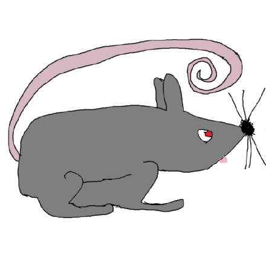

## rat [](https://github.com/hexratcc/rat/actions/workflows/test_ubuntu_latest.yml) [](https://github.com/hexratcc/rat/actions/workflows/test_windows_latest.yml)


Rat is a simple compiler backend focused on ease of use. It's inspired by [LLVM](https://llvm.org/) but focused on more novel approaches (ie. the [Sea of Nodes](https://en.wikipedia.org/wiki/Sea_of_nodes) IR) and being much easier to understand (rat is currently only about 20k LoC). To this end, rat focuses on bringing ~70% of [LLVM's](https://llvm.org/) performance with only a fraction of LLVM's complexity.

## build
```shell
$ cmake -B build
$ cmake --build build -j  # build
$ ctest --test-dir build  # run tests
```

## passes
**optimization**
- [**Fold:**](./rat/include/Pass/Opt/Fold.h) Constant folding and algebraic simplification
- [**GVN:**](./rat/include/Pass/Opt/GVN.h) Global value numbering
- [**SCCP:**](./rat/include/Pass/Opt/SCCP.h) Sparse conditional constant propagation
- [**SimplifyCFG:**](./rat/include/Pass/Opt/SimplifyCFG.h) Control-flow simplification
- [**MemoryOpt:**](./rat/include/Pass/Opt/MemoryOpt.h) Load/store forwarding
- [**Inline:**](./rat/include/Pass/Opt/Inline.h) Function inlining
- [**DeadFuncElim:**](./rat/include/Pass/Opt/DeadFuncElim.h) Drop static functions that are not referenced

**codegen**
- [**X86Lower:**](./rat/include/Pass/Emit/X86Emitter.h) Lower IR to x86 machine instructions
- [**X86Encode:**](./rat/include/Pass/Emit/X86Emitter.h) Encode x86 to an ELF or COFF object
- [**CEmitter:**](./rat/include/Pass/Emit/CEmitter.h) Emit C code

**utility**
- [**Verify:**](./rat/include/Pass/Verify.h) Edge consistency + per-opcode structural invariants
- [**RenameSymbol:**](./rat/include/Pass/Opt/RenameSymbol.h) Rename a given symbol
- [**TextEmitter:**](./rat/include/Pass/Emit/TextEmitter.h) Textual IR viz
- [**GraphEmitter:**](./rat/include/Pass/Emit/GraphEmitter.h) Graphviz DOT IR viz

## example
```cpp
Module mod("demo");

// int clamp0(int x) { if (x < 0) x = 0; return x; }
Type* i32 = mod.getInt(32);
Function* fn = mod.createFunction("clamp0", {i32}, i32);

Function::Var x = fn->declareLocal("x", fn->param(0));
Function::Block* then = fn->createBlock();
Function::Block* join = fn->createBlock();

fn->jumpif(fn->compare(Opcode::Slt, fn->get(x), fn->constInt(i32, 0)), then);
fn->jmp(join);

fn->seal(then);
fn->setInsertBlock(then);
fn->set(x, fn->constInt(i32, 0));
fn->jmp(join);

fn->seal(join);
fn->setInsertBlock(join);
fn->ret(fn->get(x));

X86Target target;
PassManager pm(target);
pm.add<VerifyPass>(std::cerr);      // structural invariants
pm.add<TextEmitterPass>(std::cout); // print the graph
pm.run(mod);
```

